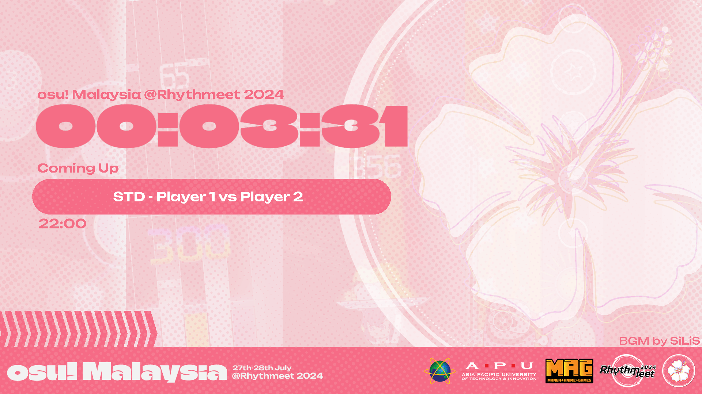
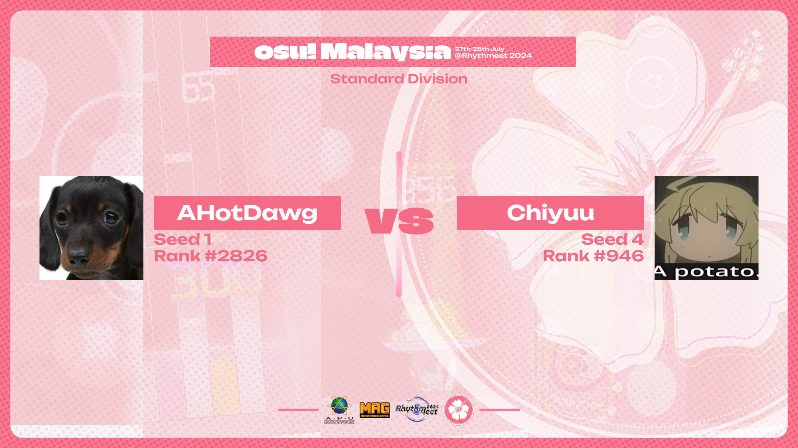
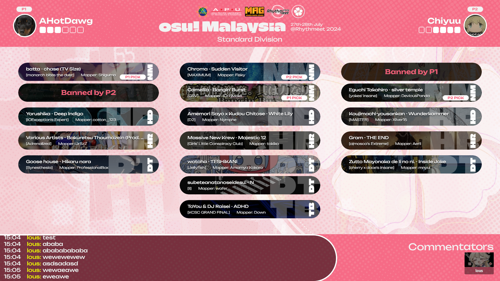
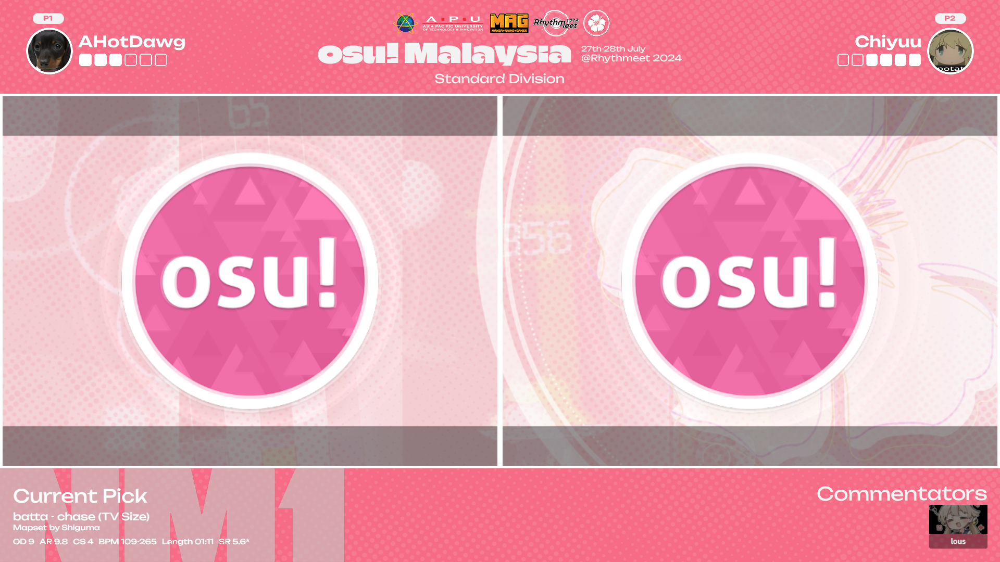
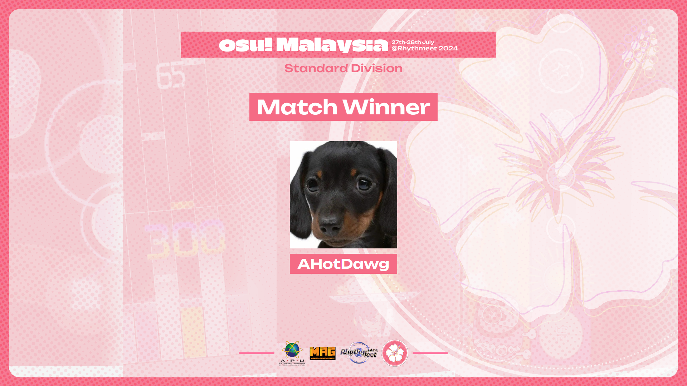
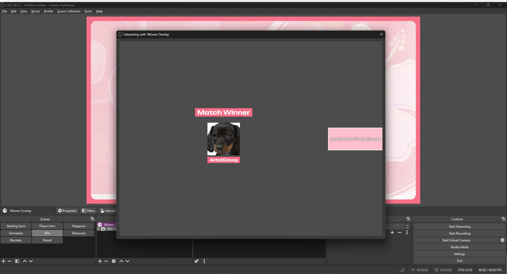
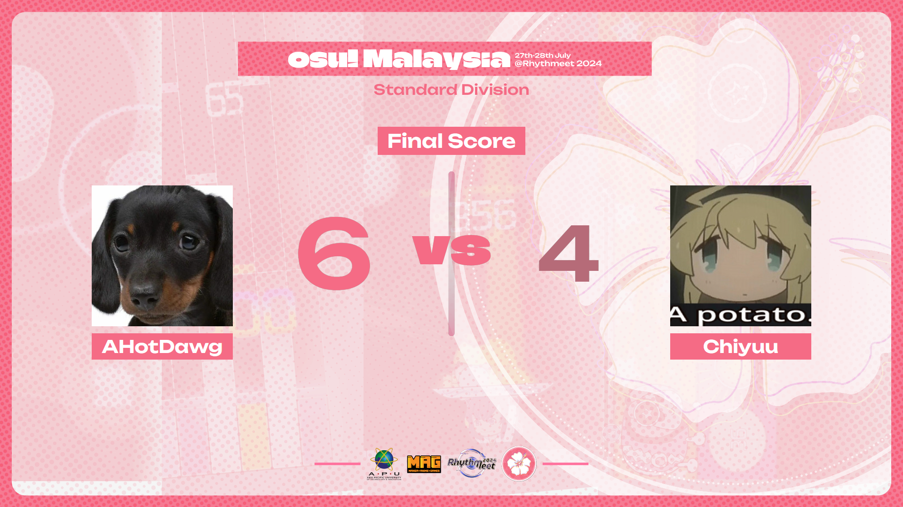
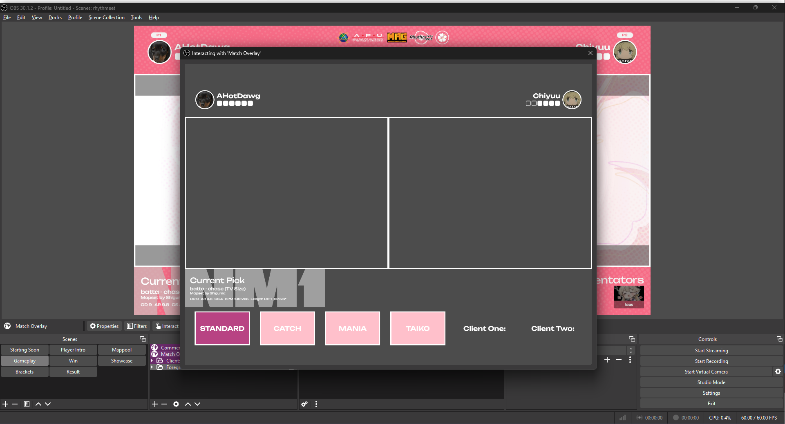

# rhythmeet-streamOverlay
The main repository for the overlay of o!MY @ Rhythmeet 2024, meant to be ran on tosu.

## Setting up OBS
The scene file is located in `_data/`. The JSON file will be named **rhythmeet_vX.X** in the directory. Just select the latest version if there are numerous jsons

After importing the scene file, you should be prompted with a Missing Files tab.

Click on "Search Directory..." and select the `_shared_assets` folder in the project files. If it doesn't fully link all the missing files, try selecting the subfolders in the `_shared_assets` folder. After that, just click on Apply and the assets should be displayed.

## Setting up beatmaps
First of all, key in your api key into `_data/api.json`.
The beatmaps is by default displaying the Standard Brackets pool, found in `_data/beatmaps.json`. If you want to switch said beatmaps, just rename your new json file into `beatmaps.json` in the same directory and you should be good to go.

## Examples of projected scenes
### Starting Soon

All text are manually adjusted, including the Coming Up Text, and timeslot.

### Player Intro

### Mappool Scene

- Left Click to pick for **Player 1**
- Right Click to pick for **Player 2**
- Shift + Left Click to ban for **Player 1**
- Shift + Right Click to ban for **Player 2**
- Ctrl + Left Click to retract any actions

### Match Scene

Client backgrounds can be found in `_shared_assets/client`. Just drag each bg respectively into each client

### Winner Scene

To switch to the next scene, you need to click the `ACTIVATE FINAL SCORE` button by interacting with the `Winner Overlay` Element in OBS

## NOTE FOR MODE SWITCHING
As there are different calculations in SR for different modes, you need to adjust your `osu!.[username].cfg` file to show that your last gamemode is the current division you are streaming.

Find the `LastPlayMode = ` row in your .cfg file and set it one of the following:
- `LastPlayMode = Standard`
- `LastPlayMode = CatchTheBeat`
- `LastPlayMode = Mania`
- `LastPlayMode = Taiko`

Make sure that your tournament client isn't open at this time and upon saving the .cfg file relaunch it to see if the star rating is calculating properly. 

To show the appropriate stats in the `MATCH` scene, you can interact with the `Match Overlay` element in OBS to switch between the modes. Additionally you can find which player is on which client at that current moment.

